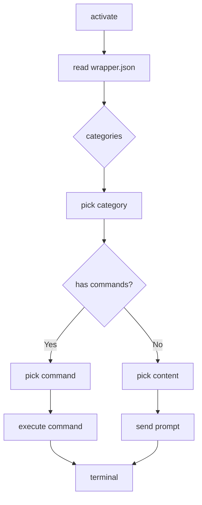

# wrap

An opinionated extension that provides a **Wrapper** command menu for quickly running shell commands or sending prompts to a shared terminal. The extension is designed for AI-assisted development workflows, such as sending prompts to Coder, Claude, Codex, Gemini or any interactive CLI.  It is lightweight, built in TypeScript, and requires only the VS Code API.

---

## Table of Contents

- [Architecture](#architecture)
- [Directory structure](#directory-structure)
- [Installation](#installation)
- [Configuration](#configuration)
- [Usage](#usage)
- [Command workflow](#command-workflow)
- [Contributing](#contributing)
- [License](#license)

---

## Architecture

The extension is split into a few logical layers:

```
┌───────────────────────────────┐
│ 1. Activation & UI            │
├───────────────────────────────┤
│ 2. Configuration loading      │
├───────────────────────────────┤
│ 3. Menu rendering             │
├───────────────────────────────┤
│ 4. Terminal management        │
├───────────────────────────────┤
│ 5. Command/Content execution  │
└───────────────────────────────┘
```

* **Activation & UI** – the status bar item and the `wrapper.showMenu` command.
* **Configuration loading** – reads `wrapper.json` from the workspace or a custom location.
* **Menu rendering** – shows two-level notifications: first a category picker, then a command/prompt picker.
* **Terminal management** – a single reusable terminal, optionally launched under WSL on Windows.
* **Command/Content execution** – injects shell commands or raw prompt text into the terminal.



---

## Directory structure

```
├─ assets
│  └─ images
│      └─ icon.png            # Extension icon
├─ src
│  └─ extension.ts           # Main extension logic
├─ wrapper.json              # Sample configuration (optional)
├─ package.json              # Extension manifest
├─ tsconfig.json             # TypeScript config
└─ README.md                 # This file
```

## Installation

1. Clone the repo:
   ```bash
   git clone https://github.com/mochiyaki/helper.git
   ```
2. Install deps and build:
   ```bash
   cd agent-git
   npm install
   npm run build   # creates dist/extension.js
   ```
3. From VS Code, press `Ctrl+Shift+P` → **Extensions: Install from VSIX** → select the VSIX you built (or use `code --install-extension <vsix>`).

## Configuration

Create a `wrapper.json` in the workspace root (or specify a custom path via the `wrapper.configPath` setting). Example:

```json
[
  {
    "Command": [
      {"Open terminal": "echo 'Hello, world!'"}
    ],
    "Prompt": [
      {"Ask AI": "What is the meaning of life?"}
    ]
  }
]
```

- **Command** entries contain shell commands.
- **Prompt** entries contain free‑form text that will be sent directly to the terminal.

## Usage

1. Click the **Wrapper** status bar icon or press `Ctrl+Alt+W` (configured via `commands.json`).
2. The first notification lists your categories.
3. Select a category.
4. Choose a command or prompt.
5. *Command* entries are executed in the shared terminal.
6. *Prompt* entries are pasted into the terminal as raw input.

You can launch the shared terminal explicitly via the status bar icon before selecting a prompt to avoid the confirm dialog.

## Command workflow

The workflow is fully deterministic:

1. **Show Menu** – `wrapper.showMenu` is the only command.
2. **Load Config** – reads `wrapper.json` once per invocation.
3. **Category Picker** – uses `vscode.window.showInformationMessage` with a list of category names.
4. **Action Picker** – similarly shows command/prompts.
5. **Execute** –
   * For *Command*: `sharedTerminal.sendText(command)`.
   * For *Prompt*: `window.showWarningMessage` (if no terminal) → `workbench.action.terminal.sendSequence`.
6. **Terminal Persistence** – the shared terminal keeps state between invocations until closed.

When running on Windows with `wrapper.useWsl=true`, the terminal uses WSL under Ubuntu.

## Contributing

1. Fork the repo.
2. Create a feature branch.
3. Write tests (optional) and update docs.
4. Submit a PR.

Please keep the code style consistent with the existing code (TS + VS Code API). No linting is configured yet, but you may run your own formatter.

## License

MIT
